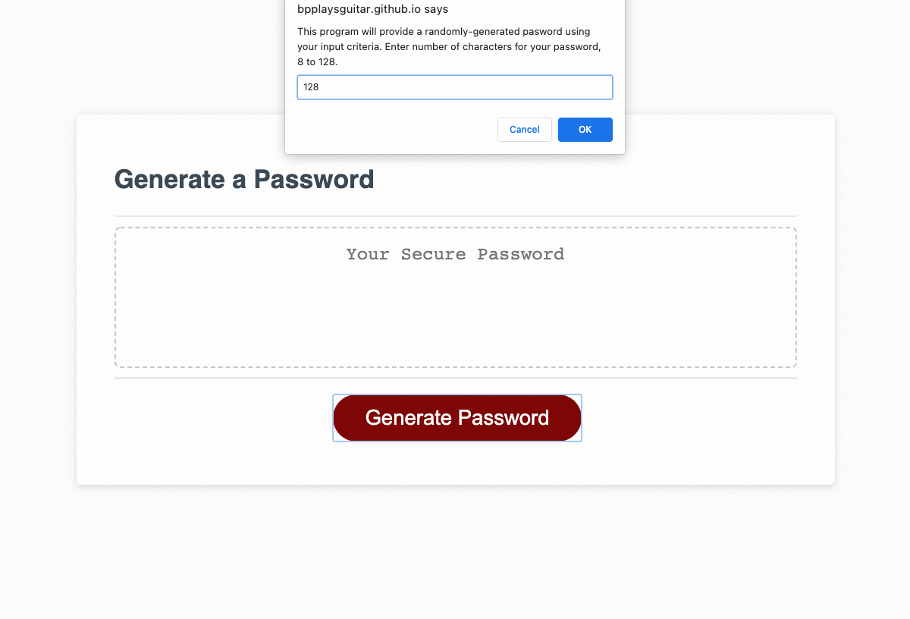

# random-password-generator
Brian Palay  
612-202-5710  
brianpalay@gmail.com

See the project live here:
https://bpplaysguitar.github.io/random-password-generator/

## Description
This assignment was to use Javascript to create a web application that will generate passwords using random methods, based on user input of character types to be used in the generation of the password. I was able to learn a lot of new ways to use Javascript, including building entire arrays based on front-end user interaction, more in depth "for" loop and "if" statement uses, and I became very familiar with ASCII character codes. I also learned in talking about this with some developer friends, what makes a truly secure password. We went over the math of the possible permutations. In short: the longer the better, more than anything else. It's a gratifying feeling to build a highly functional and truly useful application, test it over and over, and get it work the way you want.

## Technologies Used
HTML  
CSS  
JavaScript  

## Installation

1. Provided that you have a code editor of your choosing installed on your system, such as VS Code (https://code.visualstudio.com/),

2. Provided that you have a Terminal installed for Windows (https://www.microsoft.com/en-us/p/windows-terminal/9n0dx20hk701?rtc=1&activetab=pivot:overviewtab) or are using a Mac with Terminal installed with the OS,

3. You have Git and Github Desktop installed (https://git-scm.com/downloads, https://desktop.github.com/) and have registered for an account,

4. Clone this repository:
git clone https://github.com/bpplaysguitar/random-password-generator.git or git clone git@github.com:bpplaysguitar/random-password-generator.git

5. Create your own repository for the files on GitHub.

6. Edit in your code editor and continue to commit, push changes and perform other Git actions using your repository https://docs.gitlab.com/ee/gitlab-basics/start-using-git.html

## Usage

Animation of application in use

## Credits

Profssional README guide template provided by Coding Boot Camp. https://github.com/coding-boot-camp

## License

MIT License

Copyright (c) 2021 Brian Palay

Permission is hereby granted, free of charge, to any person obtaining a copy
of this software and associated documentation files (the "Software"), to deal
in the Software without restriction, including without limitation the rights
to use, copy, modify, merge, publish, distribute, sublicense, and/or sell
copies of the Software, and to permit persons to whom the Software is
furnished to do so, subject to the following conditions:

The above copyright notice and this permission notice shall be included in all
copies or substantial portions of the Software.

THE SOFTWARE IS PROVIDED "AS IS", WITHOUT WARRANTY OF ANY KIND, EXPRESS OR
IMPLIED, INCLUDING BUT NOT LIMITED TO THE WARRANTIES OF MERCHANTABILITY,
FITNESS FOR A PARTICULAR PURPOSE AND NONINFRINGEMENT. IN NO EVENT SHALL THE
AUTHORS OR COPYRIGHT HOLDERS BE LIABLE FOR ANY CLAIM, DAMAGES OR OTHER
LIABILITY, WHETHER IN AN ACTION OF CONTRACT, TORT OR OTHERWISE, ARISING FROM,
OUT OF OR IN CONNECTION WITH THE SOFTWARE OR THE USE OR OTHER DEALINGS IN THE
SOFTWARE.
